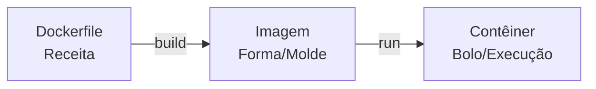

# Modelo Mental: Imagens e Contêineres

| Conceito | O que é | Analogia |
| :--- | :--- | :--- |
| **Dockerfile** | Arquivo de texto com as instruções de como construir a imagem. | A receita do bolo. |
| **Imagem** | Pacote estático contendo código, SO mínimo e bibliotecas. É imutável. | A forma de bolo com a massa pronta. |
| **Contêiner** | Uma instância em execução de uma imagem. Pode ser iniciado, pausado e destruído. | O bolo pronto sendo consumido. |
| **Registry** | Local onde as imagens são armazenadas (ex: Docker Hub). | O supermercado ou a padaria. |
