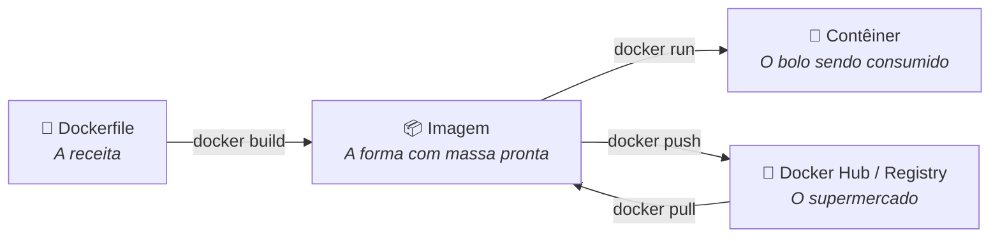
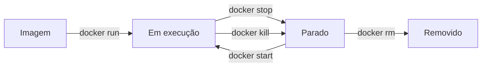

# Modelo Mental: Imagens e Contêineres

Antes de sair rodando comandos, é essencial entender os **três conceitos centrais** do Docker.

---

## A Analogia da Receita de Bolo 🎂



| Conceito | O que é | Analogia |
| :--- | :--- | :--- |
| **Dockerfile** | Arquivo de texto com instruções para construir a imagem. | A receita do bolo — lista de ingredientes e modo de fazer. |
| **Imagem** | Pacote estático contendo código, SO mínimo e bibliotecas. É **imutável**. | A forma de bolo com a massa pronta e padronizada. |
| **Contêiner** | Uma instância **em execução** de uma imagem. Pode ser iniciado, pausado e destruído. | O bolo pronto sendo consumido — pode ter vários ao mesmo tempo. |
| **Registry** | Local onde as imagens são armazenadas e compartilhadas. | O supermercado ou padaria onde você busca formas prontas. |

---

## Entendendo na Prática

### Uma Imagem → Vários Contêineres

Da mesma imagem, você pode criar quantos contêineres quiser, todos independentes:

```bash
# Sobe 3 instâncias da mesma imagem nginx em portas diferentes
docker run -d -p 8001:80 --name site-dev nginx
docker run -d -p 8002:80 --name site-staging nginx
docker run -d -p 8003:80 --name site-prod nginx
```

Agora você tem 3 servidores web rodando ao mesmo tempo!

```bash
docker ps
```

```
CONTAINER ID   IMAGE   COMMAND                  PORTS                  NAMES
a1b2c3d4e5f6   nginx   "/docker-entrypoint.…"   0.0.0.0:8001->80/tcp   site-dev
b2c3d4e5f6a1   nginx   "/docker-entrypoint.…"   0.0.0.0:8002->80/tcp   site-staging
c3d4e5f6a1b2   nginx   "/docker-entrypoint.…"   0.0.0.0:8003->80/tcp   site-prod
```
---

## Ciclo de Vida de um Contêiner



| Estado | Descrição |
| :--- | :--- |
| **Em execução** | O processo principal do contêiner está ativo. |
| **Parado** | O contêiner existe mas não está consumindo CPU. Pode ser reiniciado. |
| **Removido** | O contêiner foi deletado. Os dados não persistidos são perdidos. |

---

## Docker Hub: o repositório público de imagens

O [Docker Hub](https://hub.docker.com) é como o GitHub, mas para imagens Docker. Lá você encontra imagens oficiais e prontas para uso de praticamente qualquer tecnologia:

- `nginx` — servidor web
- `postgres` — banco de dados PostgreSQL
- `python` — interpretador Python
- `node` — runtime Node.js
- `redis` — banco de dados em memória
- `mysql` — banco de dados MySQL
```bash
# Baixa a imagem oficial do PostgreSQL versão 16
docker pull postgres:16-alpine

# Lista as imagens baixadas
docker images
```

```
REPOSITORY   TAG          IMAGE ID       SIZE
postgres     16-alpine    a1b2c3d4e5f6   268MB
nginx        latest       b2c3d4e5f6a1   187MB
```
