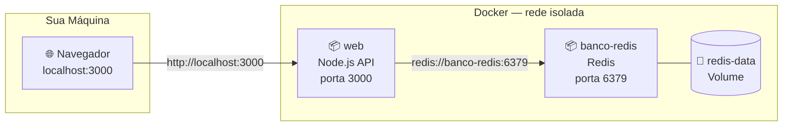

# Projeto Prático de Docker

Vamos colocar **todo o universo Docker** em prática! Neste exercício, você vai construir um ambiente completo com uma **API Node.js** e um **banco de dados Redis** — ambos dockerizados, comunicando-se em rede isolada e com dados persistidos.

!!! info "Pré-requisitos"
    Docker instalado e rodando. Você vai precisar de 3 arquivos: `app.js`, `package.json` e `Dockerfile`.

---

## Visão Geral da Arquitetura



<div class="img-placeholder">
  <span>📸 Imagem: Diagrama arquitetural colorido com os dois contêineres (Node.js e Redis) conectados na rede Docker e o volume de persistência</span>
</div>

---

## Parte 1 — O Código da Aplicação

Crie uma pasta chamada `meu-app-docker` e dentro dela crie os arquivos:

**`app.js`** — API simples de contador de visitas:

```javascript
const express = require('express');
const redis = require('redis');

const app = express();

// Conecta ao Redis usando o NOME do contêiner como host (DNS do Docker)
const client = redis.createClient({ url: 'redis://banco-redis:6379' });

client.connect().catch(console.error);

app.get('/', async (req, res) => {
  await client.incr('visitas');
  const visitas = await client.get('visitas');
  res.send(`
    <h1>🐳 Olá do Docker!</h1>
    <p>Esta página foi visitada <strong>${visitas}</strong> vezes.</p>
    <p>Atualize a página para ver o contador subir!</p>
  `);
});

app.listen(3000, () => console.log('✅ API rodando na porta 3000'));
```

**`package.json`**:

```json
{
  "name": "meu-app-docker",
  "version": "1.0.0",
  "scripts": {
    "start": "node app.js"
  },
  "dependencies": {
    "express": "^4.18.0",
    "redis": "^4.6.0"
  }
}
```

---

## Parte 2 — A Receita do Contêiner (Dockerfile)

No mesmo diretório, crie o `Dockerfile`:

```dockerfile
# Usa uma imagem leve do Node.js
FROM node:18-alpine

# Define o diretório de trabalho
WORKDIR /usr/src/app

# Otimização de cache: copia e instala dependências primeiro
COPY package*.json ./
RUN npm install

# Copia o resto do código
COPY . .

# Porta que a aplicação usa
EXPOSE 3000

# Inicia a aplicação
CMD ["node", "app.js"]
```

Também crie o `.dockerignore`:
```text
node_modules/
.env
*.log
```

<div class="img-placeholder">
  <span>📸 Imagem: VS Code mostrando a estrutura do projeto com os 4 arquivos criados: app.js, package.json, Dockerfile e .dockerignore</span>
</div>

---

## Parte 3 — Orquestrando com docker-compose.yml

Crie o arquivo `docker-compose.yml` na raiz do projeto:

```yaml
version: '3.8'

services:

  # Serviço 1: Nossa aplicação Node.js
  web:
    build: .                    # constrói a partir do Dockerfile local
    container_name: app-web
    ports:
      - "3000:3000"             # acesso pelo navegador em localhost:3000
    depends_on:
      - banco-redis             # só inicia após o Redis estar pronto

  # Serviço 2: Banco de dados Redis
  banco-redis:
    image: "redis:7-alpine"     # imagem pronta do Docker Hub
    container_name: app-redis
    volumes:
      - redis-data:/data        # persiste os dados no volume

volumes:
  redis-data:                   # Docker gerencia este volume
```

---

## Parte 4 — O Momento Mágico 🚀

Na pasta do projeto, execute:

```bash
docker-compose up -d
```

O Docker vai automaticamente:

1. **Baixar** a imagem do Redis (se você não tiver localmente).
2. **Baixar** a imagem base do Node.js (alpine).
3. **Seguir** as instruções do `Dockerfile` para instalar dependências e construir sua imagem da API.
4. **Criar** uma rede isolada automaticamente para os dois contêineres conversarem.
5. **Criar** o volume `redis-data` para persistir os dados no seu HD.
6. **Iniciar** o Redis e, logo após, a API Node.js.

Verifique que os contêineres estão rodando:

```bash
docker-compose ps
```

```
NAME          IMAGE              STATUS          PORTS
app-redis     redis:7-alpine     Up              6379/tcp
app-web       meu-app-docker-web Up              0.0.0.0:3000->3000/tcp
```

<div class="img-placeholder">
  <span>📸 Imagem: Docker Desktop mostrando os dois contêineres (app-web e app-redis) com status "Running" agrupados como "meu-app-docker"</span>
</div>

---

## Parte 5 — Testando e Explorando

**Acesse no navegador:**

Abra `http://localhost:3000` e atualize a página várias vezes — veja o contador subindo!

<div class="img-placeholder">
  <span>📸 Imagem: Navegador em http://localhost:3000 mostrando "Esta página foi visitada 5 vezes" com o layout HTML simples da API</span>
</div>

**Veja os logs da API em tempo real:**

```bash
docker-compose logs -f web
```

**Entre dentro do contêiner Redis e inspecione os dados:**

```bash
docker exec -it app-redis redis-cli
```

```
127.0.0.1:6379> GET visitas
"5"
127.0.0.1:6379> exit
```

---

## Parte 6 — Testando a Persistência

```bash
# Para e remove os contêineres (mas NÃO o volume)
docker-compose down

# Sobe tudo novamente
docker-compose up -d
```

Acesse `http://localhost:3000` de novo. O contador **começa de onde parou**, não do zero! Os dados sobreviveram porque estão no volume `redis-data`, não dentro do contêiner.

---

## Resumo dos Arquivos

```
meu-app-docker/
├── app.js              # Código da API Node.js
├── package.json        # Dependências do Node
├── Dockerfile          # Receita para construir a imagem da API
├── .dockerignore       # Arquivos ignorados no build
└── docker-compose.yml  # Orquestração dos 2 serviços
```

!!! success "Você dominou o Docker! 🐳"
    Em **5 arquivos**, você definiu e documentou a infraestrutura completa de um sistema. Qualquer outro desenvolvedor que clonar este projeto do GitHub só precisará de **um comando** para ter tudo funcionando:
    ```bash
    docker-compose up -d
    ```
