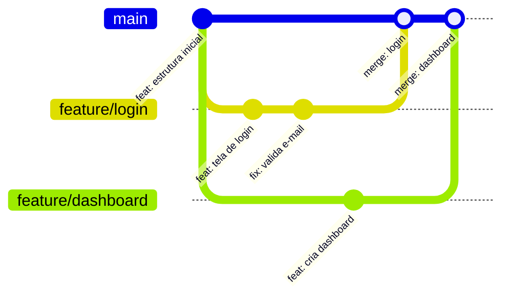
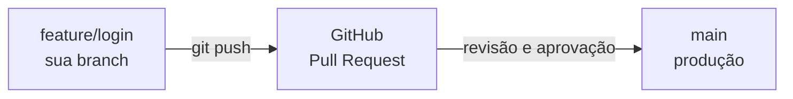

# Branches e Colaboração

## O que são Branches?

Branch é uma **linha paralela de desenvolvimento**. Ela permite criar uma cópia isolada do projeto para trabalhar em uma nova funcionalidade ou correção — sem mexer na versão principal que está funcionando.


---

## 🧪 Tutorial Guiado: Trabalhando com Branches

### Passo 1 — Veja em qual branch você está

```bash
git branch
```

O asterisco `*` indica a branch atual:
```
* main
```

### Passo 2 — Crie e entre em uma nova branch

```bash
git switch -c feature/login
```

!!! note "O que acontece?"
    O Git cria a branch `feature/login` e já muda para ela. Agora qualquer commit que você fizer ficará **apenas nessa branch**, sem afetar a `main`.

!!! tip "Dica de IDE: trocar de branch no VS Code"
    No **canto inferior esquerdo** do VS Code você vê o nome da branch atual (ex: `main`). Clique nele para ver a lista de branches e trocar — ou criar uma nova diretamente pela interface.
### Passo 3 — Faça suas alterações e commits

```bash
echo "<form>Login</form>" > login.html
git add login.html
git commit -m "feat: adiciona tela de login"
```

### Passo 4 — Volte para a main e faça o merge

```bash
git switch main
git merge feature/login
```

**Saída esperada:**
```
Updating a1b2c3d..f4e5d6c
Fast-forward
 login.html | 1 +
 1 file changed, 1 insertion(+)
```

### Passo 5 — Apague a branch após o merge (boa prática)

```bash
git branch -d feature/login
```

---

## 📋 Tabela de Comandos de Branch

| Comando | Função |
| :--- | :--- |
| `git branch` | Lista todas as branches locais. |
| `git branch -a` | Lista branches locais e remotas. |
| `git switch nome` | Troca para a branch indicada. |
| `git switch -c nome` | Cria uma nova branch e já entra nela. |
| `git merge nome` | Junta a branch indicada na branch atual. |
| `git branch -d nome` | Apaga uma branch já mesclada. |

---

## ☁️ Repositórios Remotos

Um repositório remoto é uma cópia do seu projeto armazenada em um servidor (GitHub, GitLab, Bitbucket). Ele permite colaboração entre pessoas e serve como backup.

### Fluxo básico com GitHub

**1 — Clone um repositório existente:**
```bash
git clone https://github.com/usuario/repositorio.git
cd repositorio
```

**2 — Ou conecte um repositório local a um remoto:**
```bash
git remote add origin https://github.com/usuario/repositorio.git
git push -u origin main
```

**3 — Envie seus commits para o remoto:**
```bash
git push
```

**4 — Baixe atualizações do remoto:**
```bash
git pull
```

!!! tip "Dica de IDE: Sync no VS Code"
    Após fazer commit, o VS Code mostra um ícone de **sincronização** na barra de status (↑ para push, ↓ para pull). Clicar nele faz o push/pull automaticamente.
| Comando | Função |
| :--- | :--- |
| `git clone URL` | Copia um repositório remoto para a máquina local. |
| `git remote -v` | Lista os repositórios remotos configurados. |
| `git push` | Envia commits locais para o servidor. |
| `git pull` | Baixa e integra as alterações do remoto. |
| `git fetch` | Baixa as alterações do remoto sem integrá-las. |

---

## 🔀 Pull Request / Merge Request

Em equipes, **ninguém envia diretamente para a `main`**. O fluxo correto é: criar uma branch → trabalhar → abrir um Pull Request (GitHub) ou Merge Request (GitLab) → aguardar revisão do time.



**Tutorial: Abrindo um Pull Request no GitHub**

1. Faça o push da sua branch:
   ```bash
   git push -u origin feature/login
   ```

2. Acesse o GitHub — ele vai exibir automaticamente um botão **"Compare & pull request"**.
3. Clique nele, adicione um **título descritivo** e uma **descrição das mudanças**.

4. Clique em **"Create pull request"** e aguarde a revisão.
---

## ⚡ Conflitos

Conflito acontece quando o Git não consegue decidir sozinho qual versão de uma linha deve prevalecer (duas pessoas editaram a mesma linha de formas diferentes).

```text
<<<<<<< HEAD
Título do sistema
=======
Título da aplicação
>>>>>>> feature/titulo
```

**Como resolver:**

1. Abra o arquivo com conflito no VS Code — ele exibe os conflitos com destaque visual e botões de ação:
2. Clique em **"Accept Current Change"**, **"Accept Incoming Change"** ou edite manualmente para mesclar as duas versões.

3. Após resolver todos os conflitos:
   ```bash
   git add arquivo-resolvido.html
   git commit
   ```

!!! success "Como reduzir conflitos"
    Faça branches menores, commits frequentes, dê `git pull` antes de começar e avise a equipe ao mexer em arquivos compartilhados.
