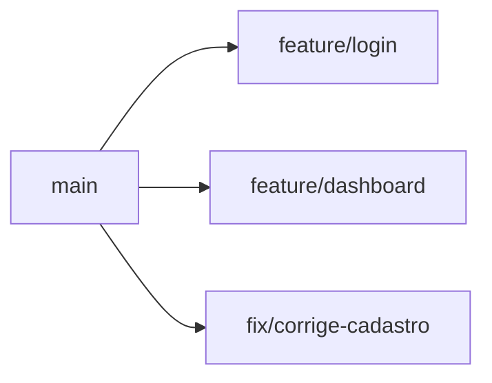
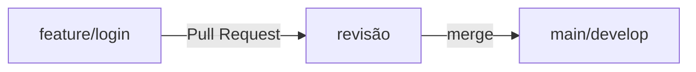

# Branches e Colaboração

## Branches

Branch é uma linha paralela de desenvolvimento. Ela permite trabalhar em uma funcionalidade sem mexer diretamente na versão principal do projeto.



| Comando | Função |
| :--- | :--- |
| `git branch` | Lista branches locais. |
| `git switch nome` | Troca de branch. |
| `git switch -c nome` | Cria e entra em uma branch. |
| `git merge nome` | Junta a branch indicada na branch atual. |

```bash
git branch
git switch -c feature/login
# Faça suas alterações...
git switch main
git merge feature/login
```

---

## Repositórios Remotos

Repositórios remotos ficam em plataformas como GitHub, GitLab ou Bitbucket.

```bash
git clone URL_DO_REPOSITORIO
git remote -v
git remote add origin URL_DO_REPOSITORIO
git push -u origin main
git pull
git fetch
```

* `git push`: Envia seus commits locais para o servidor remoto.
* `git pull`: Baixa alterações remotas e tenta integrá-las à sua branch local.

---

## Pull Request / Merge Request

Em equipes, o fluxo mais comum é não enviar tudo diretamente para `main`. O ideal é criar uma branch, enviar para o remoto e abrir uma solicitação de revisão.



```bash
git switch -c feature/login
# altere os arquivos
git add .
git commit -m "feat: adiciona tela de login"
git push -u origin feature/login
```

No GitHub, isso se chama **Pull Request**. No GitLab, normalmente se chama **Merge Request**.

---

## Conflitos

Conflito acontece quando o Git não consegue decidir sozinho qual alteração deve prevalecer.

```text
<<<<<<< HEAD
Título do sistema
=======
Título da aplicação
>>>>>>> feature/titulo
```

Você edita manualmente o arquivo, deixa a versão correta e depois executa:
```bash
git add arquivo-com-conflito
git commit
```

!!! success "Como reduzir conflitos"
    Faça branches menores, commits frequentes, dê `git pull` antes de começar e comunique alterações grandes com a equipe.
