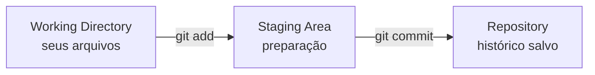

# 1. O que é Git?

Git é um sistema de controle de versão distribuído. Na prática, ele registra o histórico de alterações de um projeto e permite saber o que foi alterado, quando foi alterado, por quem foi alterado e por qual motivo.

**Sem Git:**
```text
trabalho_final.docx
trabalho_final_corrigido.docx
trabalho_final_agora_vai.docx
trabalho_final_final_mesmo.docx
```

**Com Git:**
```text
commit 1: cria estrutura inicial
commit 2: adiciona tela de login
commit 3: corrige validação
commit 4: prepara versão 1.0.0
```

!!! note "Ideia central"
    Git é uma linha do tempo organizada do seu projeto.

## 2. Por que Git é importante?

* **Histórico:** Permite voltar a versões antigas, comparar mudanças e entender a evolução do projeto.
* **Colaboração:** Várias pessoas podem trabalhar no mesmo projeto com menos risco de sobrescrever alterações.
* **Segurança:** Reduz perda de trabalho e ajuda a recuperar versões estáveis quando algo dá errado.
* **Organização:** Branches permitem separar funcionalidades, correções, experimentos e versões de produção.
* **Profissionalismo:** Git é padrão em equipes de software, dados, documentação técnica, DevOps e pesquisa aplicada.
* **Automação:** Integra-se com CI/CD, testes automatizados, deploys, releases e GitHub Pages.

## 3. Modelo mental do Git



| Área | Significado | Comando relacionado |
| :--- | :--- | :--- |
| **Working Directory** | Pasta onde você edita arquivos. | `git status` |
| **Staging Area** | Área de preparação do próximo commit. | `git add` |
| **Repository** | Histórico salvo dentro da pasta `.git`. | `git commit` |
