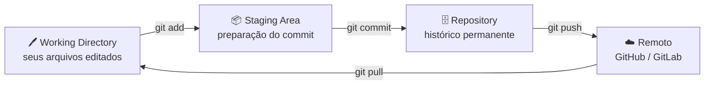

# O que é Git?

Git é um sistema de **controle de versão distribuído**. Na prática, ele registra o histórico de alterações de um projeto e permite saber o que foi alterado, quando, por quem e por qual motivo.

## 1. O problema que o Git resolve

Sem controle de versão, é comum ver pastas assim:

```text
trabalho_final.docx
trabalho_final_corrigido.docx
trabalho_final_agora_vai.docx
trabalho_final_final_mesmo.docx
trabalho_final_ESSE_AQUI.docx
```

**Com Git**, o mesmo projeto fica organizado assim:

```text
commit 1: cria estrutura inicial
commit 2: adiciona tela de login
commit 3: corrige validação do formulário
commit 4: prepara versão 1.0.0
```

<div class="img-placeholder">
  <span>📸 Imagem: Comparação visual — pasta bagunçada de arquivos duplicados vs. histórico limpo de commits no Git</span>
</div>

!!! note "Ideia central"
    Git é uma **linha do tempo organizada** do seu projeto. Você pode viajar para qualquer ponto nessa linha do tempo.

---

## 2. Por que Git é importante?

| Benefício | Descrição |
| :--- | :--- |
| 📜 **Histórico** | Permite voltar a versões antigas, comparar mudanças e entender a evolução do projeto. |
| 🤝 **Colaboração** | Várias pessoas trabalham no mesmo projeto com menos risco de sobrescrever alterações. |
| 🛡️ **Segurança** | Reduz perda de trabalho e ajuda a recuperar versões estáveis quando algo dá errado. |
| 🌿 **Organização** | Branches separam funcionalidades, correções, experimentos e versões de produção. |
| 💼 **Profissionalismo** | Padrão em equipes de software, dados, documentação técnica, DevOps e pesquisa. |
| ⚙️ **Automação** | Integra-se com CI/CD, testes automatizados, deploys e GitHub Pages. |

---

## 3. Modelo Mental do Git

O Git organiza seu trabalho em **três áreas** distintas:



| Área | O que é | Comando relacionado |
| :--- | :--- | :--- |
| **Working Directory** | A pasta onde você edita seus arquivos normalmente. | `git status` |
| **Staging Area** | Área de preparação — você escolhe o que vai entrar no próximo commit. | `git add` |
| **Repository** | O histórico salvo dentro da pasta oculta `.git`. | `git commit` |
| **Remoto** | Uma cópia do repositório em um servidor (GitHub, GitLab, etc.). | `git push` / `git pull` |

<div class="img-placeholder">
  <span>📸 Imagem: Diagrama visual das 3 áreas do Git — Working Directory, Staging Area e Repository — com setas e ícones</span>
</div>

---

## 4. Experimente: vendo as três áreas na prática

Abra o terminal e siga este mini-tutorial:

**1.** Crie um repositório vazio:
```bash
mkdir teste-git && cd teste-git
git init
```

**2.** Crie um arquivo (ele nasce no **Working Directory**):
```bash
echo "Olá, Git!" > arquivo.txt
git status
```

!!! note "Observe a saída"
    O Git mostrará `arquivo.txt` em **vermelho** como "Untracked files" — ele existe, mas o Git ainda não está rastreando.

**3.** Mova para a **Staging Area**:
```bash
git add arquivo.txt
git status
```

!!! note "Observe a saída"
    Agora `arquivo.txt` aparece em **verde** como "Changes to be committed".

**4.** Salve no **Repository** (histórico permanente):
```bash
git commit -m "docs: adiciona arquivo inicial"
git log --oneline
```

Você acabou de criar seu primeiro ponto na linha do tempo! 🎉
