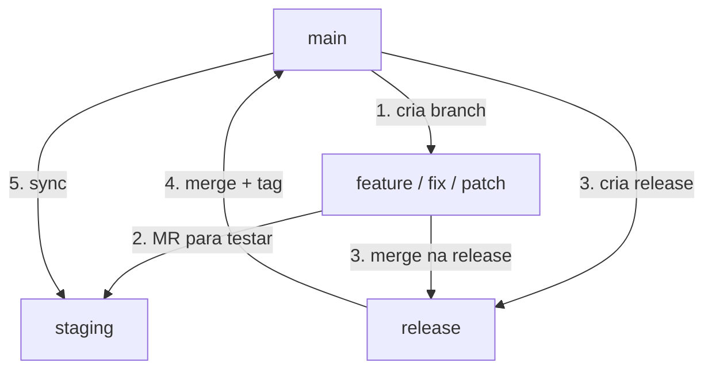

# Branches — Estrutura e Nomenclatura

---

## Estrutura do fluxo



---

## `main` — Produção

O **código estável publicado**. Referência absoluta do projeto.

| Regra | Descrição |
|-------|-----------|
| Base de tudo | Todas as branches nascem de `main` |
| Sem commit direto | Código só entra via merge de release |
| Tags obrigatórias | Cada merge de release recebe uma tag semântica |

---

## `staging` — Testes Integrados

**Ambiente de validação apenas.** Testa features juntas antes da release.

| Regra | Descrição |
|-------|-----------|
| Apenas para teste | Recebe features para validação integrada |
| Nunca é base | Não crie branches a partir de staging |
| Nunca faça rebase dela | Staging pode conter código experimental |
| Sync com main | Após cada release, staging é atualizada com main |

!!! danger "Staging NÃO é base de desenvolvimento"
    - Não crie branches a partir de staging
    - Não faça `git rebase staging`
    - Se você rebasar de staging, pode herdar código instável

---

## Branches de trabalho

| Tipo | Quando usar | Exemplo |
|------|-------------|---------|
| `feature/*` | Nova funcionalidade | `birads-42-implement-cnn-model` |
| `fix/*` | Correção de bug | `birads-87-fix-classification-threshold` |
| `patch/*` | Ajuste menor | `birads-200-integrate-anonymization` |

---

## Nomenclatura obrigatória

```
[projeto]-[taiga-id]-short-description
```

| Parte | Regra | Exemplo |
|-------|-------|---------|
| `projeto` | Nome do projeto (definido pelo coordenador) | `birads`, `cappy` |
| `taiga-id` | ID da tarefa no **Taiga** | `42`, `115`, `200` |
| `short-description` | Descrição curta em inglês, separada por hífens | `implement-cnn-model` |

!!! warning "Regra obrigatória"
    - Toda branch **deve** ter uma tarefa no Taiga
    - O prefixo é definido pelo **coordenador do projeto**
    - Não crie branches sem issue — se não existe, crie-a primeiro

**Exemplos:**

```
birads-42-implement-cnn-segmentation-model
birads-87-fix-birads-classification-threshold
birads-115-add-patient-management-dashboard
cappy-123-implement-user-authentication
cappy-456-fix-login-button-alignment
```

---

## Criação e atualização

```bash
# Criar (SEMPRE de main)
git switch main
git pull
git switch -c birads-42-implement-cnn-model

# Manter atualizada (SEMPRE rebase de main)
git switch main && git pull
git switch birads-42-implement-cnn-model
git rebase main
```

!!! danger "Nunca faça"
    ```bash
    git switch staging
    git switch -c minha-feature        # ❌ branch de staging

    git switch outra-feature
    git switch -c minha-feature        # ❌ branch de outra feature

    git rebase staging                 # ❌ rebase de staging
    ```

---

## Ciclo de vida

| Etapa | Ação |
|-------|------|
| 1. Criar | `git switch -c` a partir de `main` |
| 2. Desenvolver | Commits pequenos e frequentes |
| 3. Rebase | `git rebase main` antes do MR |
| 4. MR | Abre MR apontando para `staging` |
| 5. Code review | Mínimo 1 aprovação |
| 6. Staging | Merge em staging para teste integrado |
| 7. Release | Feature entra na release branch |
| 8. Deletar | Após entrar na release |

### Quando deletar

| Momento | Deletar? |
|---------|----------|
| Feature merjou em staging (teste) | ❌ Não — ainda precisa ir pra release |
| Feature merjou na release branch | ✅ Sim |
| Release merjou em main | ✅ Sim |

---

## Boas práticas

- **Uma branch = uma tarefa do Taiga** (não misture escopos)
- **Branch curta** (1-3 dias ideal, máximo 1 semana)
- **Push diário** (backup + visibilidade)
- **Commits atômicos** (uma mudança lógica por commit)

---

## `release/*` — Preparação de versão

| Regra | Descrição |
|-------|-----------|
| Nasce de `main` | Sempre criada a partir de main |
| Recebe features validadas | Merge das branches testadas em staging |
| Ajustes finais | CHANGELOG + version bump |
| Mergeia em main | Após aprovação → tag → sync staging |

---

## Regras universais

| Regra | Descrição |
|-------|-----------|
| Nunca commit direto em `main` | Apenas releases aprovadas |
| Nunca crie branch de `staging` | Staging é só para teste |
| Nunca rebase de `staging` | Use sempre `git rebase main` |
| Tag em toda release | Cada merge em main → tag semântica |
| Code review obrigatório | Mínimo 1 aprovação por MR |
| Sync após release | `main` → `staging` |
