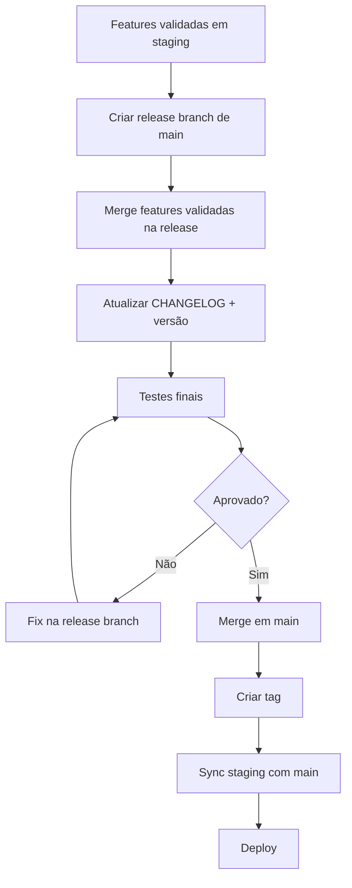

# Fluxo de Release

O processo completo de preparar, validar e publicar uma nova versão.

---

## Visão geral do processo



---

## Passo a passo

### 1. Verificar que as features foram validadas em staging

Antes de criar a release, confirme que as features planejadas foram testadas em staging e estão prontas.

!!! warning "Só crie a release se"
    - Todas as features planejadas para esta versão foram validadas em staging
    - Testes estão passando
    - Não há bugs críticos conhecidos

### 2. Criar a release branch a partir de `main`

```bash
git switch main
git pull
git switch -c release/1.2.0
git push -u origin release/1.2.0
```

### 3. Merge das features validadas na release

Apenas branches já testadas em staging e aprovadas para esta versão:

```bash
git switch release/1.2.0
git merge --no-ff cappy-123-feature-auth
git merge --no-ff cappy-456-fix-upload
git push
```

### 4. Atualizar o CHANGELOG

```markdown
## [1.2.0] - 2026-05-27

### Feature

- **Autenticação:** Implementa login com JWT e refresh token. ([#123](link))
- **Dashboard:** Adiciona gráficos de métricas em tempo real. ([#145](link))

### Fix

- **Upload:** Corrige erro ao enviar arquivos > 5MB. ([#160](link))

### Patch

- **Deps:** Atualiza dependências core para corrigir vulnerabilidades. ([#162](link))
```

```bash
git add CHANGELOG.md
git commit -m "release: update changelog for v1.2.0"
```

### 5. Bump de versão

```bash
# package.json (Node.js)
npm version 1.2.0 --no-git-tag-version

# pyproject.toml (Python) — edite manualmente: version = "1.2.0"

git add package.json  # ou pyproject.toml, VERSION, etc.
git commit -m "release: bump version to 1.2.0"
git push
```

### 6. Validação final

```bash
# Na release branch, rode tudo
npm run lint
npm test
npm run build
```

### 7. Merge em main

```bash
git switch main
git pull
git merge --no-ff release/1.2.0
git push
```

!!! note "Aprovação"
    O merge em main requer aprovação de Tech Lead ou responsável pelo módulo.

### 8. Criar tag de versão

```bash
git tag -a v1.2.0 -m "Release v1.2.0"
git push origin v1.2.0
```

### 9. Sincronizar staging

```bash
git switch staging
git pull
git merge --no-ff main
git push
```

---

## Formato do CHANGELOG

Baseado em [Keep a Changelog](https://keepachangelog.com/):

```markdown
# Changelog

All notable changes to this project will be documented in this file.

## [Unreleased]

### Feature
- (features em desenvolvimento para próxima versão)

---

## [1.2.0] - 2026-05-27

### Feature
- **Módulo:** Descrição curta da feature. ([#ID](link))

### Fix
- **Módulo:** Descrição curta do bug corrigido. ([#ID](link))

### Patch
- **Módulo:** Descrição curta da melhoria/manutenção. ([#ID](link))

---

## [1.1.0] - 2026-04-15
...
```

| Seção | O que vai aqui |
|-------|---------------|
| `Feature` | Funcionalidades novas |
| `Fix` | Bugs corrigidos |
| `Patch` | Manutenção, deps, ajustes menores |
| `Breaking` | Mudanças que quebram compatibilidade (MAJOR) |

---

## O que é permitido na release branch

| ✅ Permitido | ❌ Proibido |
|-------------|------------|
| Corrigir bugs encontrados nos testes finais | Adicionar features novas |
| Atualizar CHANGELOG | Refatorações grandes |
| Bump de versão | Mudanças de infraestrutura |
| Ajustar docs/README | Experimentos |

!!! danger "Regra"
    A release branch é para **estabilizar**, não para desenvolver.

---

## Checklist de Release

### Pré-release

- [ ] Features planejadas foram validadas em staging
- [ ] Sem bugs críticos abertos para esta versão
- [ ] Release branch criada a partir de `main`

### Na release branch

- [ ] Features validadas merjadas na release
- [ ] CHANGELOG.md atualizado com todas as mudanças
- [ ] Versão incrementada corretamente (SemVer)
- [ ] Suite completa de testes passando
- [ ] Build funciona sem erros
- [ ] Aprovação do Tech Lead

### Pós-release

- [ ] Merge em main realizado
- [ ] Tag `v[version]` criada e publicada
- [ ] Staging sincronizada com main
- [ ] Release branch deletada
- [ ] Time notificado

---

## Versionamento rápido (SemVer)

```
v MAJOR . MINOR . PATCH
  1     . 2     . 0
```

| Quando incrementar | Exemplo | De → Para |
|-------------------|---------|-----------|
| Bug fix que não quebra nada | Corrige crash no login | 1.2.0 → 1.2.**1** |
| Feature nova retrocompatível | Adiciona dark mode | 1.2.1 → 1.**3**.0 |
| Mudança que quebra API/contrato | Muda estrutura do banco | 1.3.0 → **2**.0.0 |
