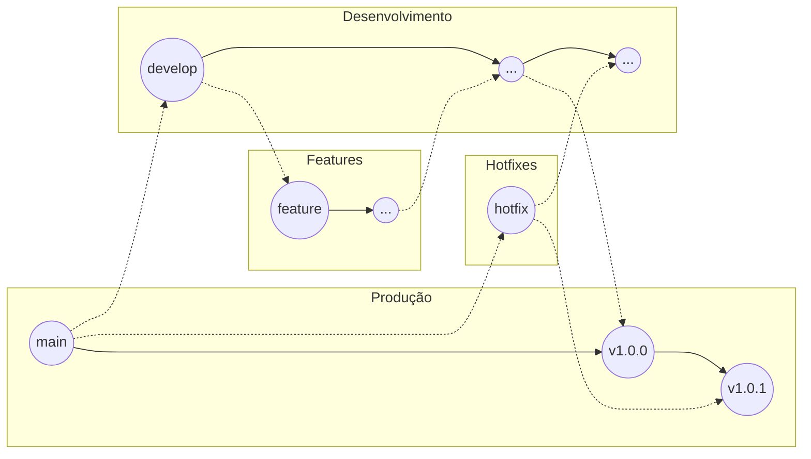

# Git Flow

Git Flow é um modelo de organização de branches para projetos com versões, releases, ambiente de produção e correções urgentes.

| Branch | Função |
| :--- | :--- |
| `main` | Código estável em produção. |
| `develop` | Integração das funcionalidades em desenvolvimento. |
| `feature/*` | Novas funcionalidades. |
| `release/*` | Preparação de uma nova versão. |
| `hotfix/*` | Correções urgentes feitas a partir da produção. |



### Criar develop
```bash
git switch main
git pull
git switch -c develop
git push -u origin develop
```

### Nova feature
```bash
git switch develop
git pull
git switch -c feature/login
# trabalhe nos arquivos
git add .
git commit -m "feat: adiciona tela de login"
git push -u origin feature/login
```

### Release
```bash
git switch develop
git pull
git switch -c release/1.0.0
# correções finais
git add .
git commit -m "chore: prepara release 1.0.0"

git switch main
git merge release/1.0.0
git tag v1.0.0
git push origin main
git push origin v1.0.0

git switch develop
git merge release/1.0.0
git push origin develop
```

### Hotfix
```bash
git switch main
git pull
git switch -c hotfix/corrige-login-producao
# corrija o problema
git add .
git commit -m "fix: corrige erro crítico no login"

git switch main
git merge hotfix/corrige-login-producao
git tag v1.0.1
git push origin main
git push origin v1.0.1

git switch develop
git merge hotfix/corrige-login-producao
git push origin develop
```
