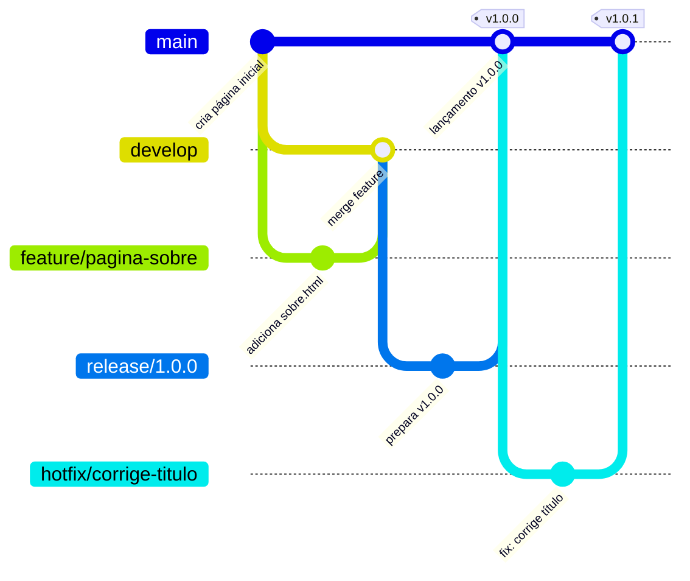

# Projeto Prático: Construindo um Site com Git

Chegou a hora de colocar a mão na massa! Neste exercício, você vai simular o fluxo real de uma pequena equipe criando um site do zero usando Git.

!!! info "Pré-requisitos"
    Antes de começar, certifique-se de ter: Git instalado (`git --version`), e uma conta no GitHub.

---

## Visão Geral do Exercício



---

## Parte 1 — Iniciando o Projeto (branch `main`)

Crie a pasta do projeto e inicie o repositório. O primeiro commit sempre vai para a branch principal.

```bash
mkdir meu-site-git
cd meu-site-git
git init
```

Crie a primeira página:
```bash
echo "<h1>Bem-vindo ao Meu Site</h1>" > index.html
git add index.html
git commit -m "feat: cria página inicial"
```

Conecte ao GitHub (crie um repositório vazio lá antes):
```bash
git remote add origin https://github.com/SEU_USUARIO/meu-site-git.git
git push -u origin main
```

<div class="img-placeholder">
  <span>📸 Imagem: GitHub — repositório recém-criado mostrando o arquivo index.html com o primeiro commit</span>
</div>

---

## Parte 2 — Branch de Desenvolvimento (`develop`)

Não trabalhamos direto na `main` para não quebrar a produção. Criamos a branch `develop` como nosso ambiente de integração:

```bash
git switch -c develop
git push -u origin develop
```

!!! tip "Dica de IDE: criando branches no VS Code"
    No canto inferior esquerdo, clique no nome da branch atual (`main`) → **"Create new branch"** → digitedesenvolvimento e confirme.

<div class="img-placeholder">
  <span>📸 Imagem: VS Code — menu de branches com a opção "Create new branch from..." mostrando a branch develop sendo criada</span>
</div>

---

## Parte 3 — Nova Funcionalidade (`feature`)

Sua equipe pediu uma página "Sobre nós". Crie uma branch separada para essa tarefa, a partir da `develop`:

```bash
git switch develop
git switch -c feature/pagina-sobre
```

Crie a nova página:
```bash
echo "<p>Sobre nossa empresa...</p>" > sobre.html
git add sobre.html
git commit -m "feat: adiciona página sobre"
```

Envie para o remoto e abra um **Pull Request** de `feature/pagina-sobre` para `develop` no GitHub:

```bash
git push -u origin feature/pagina-sobre
```

<div class="img-placeholder">
  <span>📸 Imagem: GitHub — Pull Request de `feature/pagina-sobre` para `develop` com status "Open" e botão "Merge pull request"</span>
</div>

---

## Parte 4 — Integrando a Funcionalidade (merge)

Após aprovação no Pull Request, faça o merge localmente (ou pelo GitHub):

```bash
git switch develop
git merge feature/pagina-sobre
git push
```

Apague a branch de feature — ela cumpriu seu propósito:
```bash
git branch -d feature/pagina-sobre
git push origin --delete feature/pagina-sobre
```

---

## Parte 5 — Lançando a Versão Oficial (`release`)

O site está maduro para ir ao ar! Crie uma branch de release para estabilizar:

```bash
git switch develop
git switch -c release/1.0.0

# Commit de preparação (ajuste de versão, CHANGELOG, etc.)
git commit --allow-empty -m "chore: prepara lançamento da versão 1.0.0"
```

Faça o merge na `main` e crie a tag oficial:

```bash
git switch main
git merge release/1.0.0
git tag -a v1.0.0 -m "Versão 1.0.0 - lançamento inicial do site"
git push origin main --tags
```

<div class="img-placeholder">
  <span>📸 Imagem: GitHub — aba "Releases" mostrando a tag v1.0.0 com o changelog e botão "Draft a new release"</span>
</div>

Também atualiza a `develop` com as mudanças da release:
```bash
git switch develop
git merge release/1.0.0
git push
```

---

## Parte 6 — Emergência em Produção! (`hotfix`)

Um erro crítico foi encontrado no site em produção. Precisamos corrigir imediatamente, criando uma branch a partir da `main`:

```bash
git switch main
git switch -c hotfix/corrige-titulo

echo "<h1>Bem-vindo ao Nosso Site Oficial!</h1>" > index.html
git add index.html
git commit -m "fix: corrige título da página inicial"
```

Envie a correção para a produção:
```bash
git switch main
git merge hotfix/corrige-titulo
git tag -a v1.0.1 -m "Hotfix: corrige título do site"
git push origin main --tags
```

**Crucial:** atualize também a `develop` com o hotfix:
```bash
git switch develop
git merge hotfix/corrige-titulo
git push
```

Apague a branch de hotfix:
```bash
git branch -d hotfix/corrige-titulo
```

---

## Checklist Final

Após concluir, verifique o histórico completo:

```bash
git log --oneline --graph --all
```

Você deverá ver algo como:
```text
* a1b2c3d (HEAD -> develop, origin/develop) fix: corrige título
* f4e5d6c (tag: v1.0.1, main, origin/main) Merge hotfix/corrige-titulo
* 9e8d7c6 (tag: v1.0.0) Merge release/1.0.0
* 8b7c6d5 Merge feature/pagina-sobre
* 7a6b5c4 feat: cria página inicial
```

!!! success "Parabéns!"
    Você simulou um **ciclo de vida real** de desenvolvimento de software — exatamente como grandes times de engenharia trabalham. Este é o Git Flow em ação!
